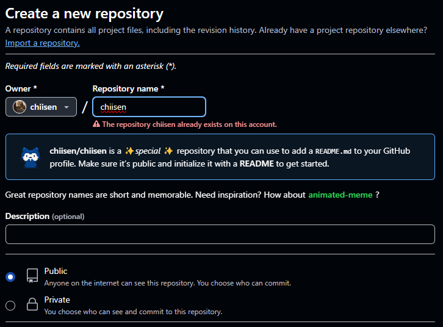

# 如何美化你的 GitHub Profile

想讓你的 GitHub Profile 獨樹一幟嗎？  
那就來試試客製化你的 README.md 檔案吧！  
具體操作如下，保證簡單易懂。

## 初始化
首先，創建一個與你的 GitHub 帳號名稱相同的新 repository（儲存庫）。  
例如：  
如果你的 GitHub 帳號是 chiisen，  
那麼新的 repository 名稱應該是 chiisen。  
如下圖所示：  

提醒一下，repository 必須設為 Public（公開）。  
建立好 repository 後，  
你就可以開始調整 README.md 檔案，  
來打造屬於你的獨特 GitHub Profile。  
可以參考我目前的設定作為範本。  
[🚀連結到 chiisen 的 GitHub Profile 設定範本🚀](https://github.com/chiisen/chiisen/blob/main/README.md?plain=1)

